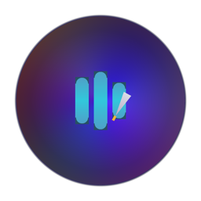

# ScribeFlow Pro

**Offline meeting transcription and local summaries for macOS.**

ScribeFlow Pro is a native macOS app from NODAYSIDLE for recording or importing meeting audio, transcribing it locally with Whisper, and producing local LLM summaries. No cloud transcription, no telemetry, no account.

- Platform: macOS 15+
- Hardware: Apple Silicon recommended
- UI: SwiftUI dark interface with Volt `#C8FF00` accent
- Build system: Swift Package Manager
- Source/release authority: GitHub
- Source: https://github.com/nodaysidle/scribeflowpro
- Latest release: https://github.com/nodaysidle/scribeflowpro/releases/tag/v1.0.0
- macOS ZIP: https://github.com/nodaysidle/scribeflowpro/releases/download/v1.0.0/ScribeFlowPro-1.0.0.zip
- SHA256: `beffaccfe10ab571f0d6237c56fd1b0e88adebeccb98029e51a479bfc24ee279`



## What works

- Live microphone recording
- Audio/video file import
- Local meeting library with transcript/detail view
- Local Whisper transcription from installed `mlx-community` models
- Local MLX LLM summarization from installed `mlx-community` models
- Model path detection under `~/Models/`
- Packaged `.app` with bundled MLX bridge scripts
- One-command local MLX runtime setup script

## Privacy contract

ScribeFlow Pro does not use telemetry, analytics, remote transcription, or hosted summarization. Network access is only used when you explicitly download local models. After setup, transcription and summarization run on your Mac.

## Install from release artifact

1. Download `ScribeFlowPro-<version>.zip` from the GitHub release.
2. Unzip it.
3. Copy `ScribeFlowPro.app` to `/Applications`.
4. Run the bundled setup once:

```bash
/Applications/ScribeFlowPro.app/Contents/Resources/Scripts/setup_mlx_runtime.sh
```

5. Open the app:

```bash
open /Applications/ScribeFlowPro.app
```

The setup script creates:

```text
~/Library/Application Support/ScribeFlowPro/venv
~/Models/mlx-community_whisper-tiny-mlx-q4
~/Models/mlx-community_Qwen2.5-0.5B-Instruct-4bit
```

## Local model smoke proof

The repo contains a real local model smoke test. It generates/uses a WAV file, transcribes it with `mlx-community/whisper-tiny-mlx-q4`, then summarizes with `mlx-community/Qwen2.5-0.5B-Instruct-4bit`.

```bash
say -v Samantha -o /tmp/scribeflowpro-smoke.aiff 'Scribe Flow Pro offline transcription smoke test. The local model should hear this sentence.'
ffmpeg -y -i /tmp/scribeflowpro-smoke.aiff -ar 16000 -ac 1 /tmp/scribeflowpro-smoke.wav
Scripts/setup_mlx_runtime.sh
SFP_LOCAL_MODEL_SMOKE=1 \
SFP_SMOKE_WHISPER_MODEL='mlx-community/whisper-tiny-mlx-q4' \
SFP_SMOKE_LLM_MODEL='mlx-community/Qwen2.5-0.5B-Instruct-4bit' \
SFP_SMOKE_AUDIO=/tmp/scribeflowpro-smoke.wav \
swift test --filter localMLXModelsSmoke
```

Expected proof lines include:

```text
SFP_SMOKE_TRANSCRIPT=scribe flow, pro offline transcription smoke test...
SFP_SMOKE_SUMMARY=...
Test localMLXModelsSmoke() passed
```

## Build, test, package

```bash
swift test
swift build -c release
Scripts/package_app.sh release
```

Create a downloadable zip:

```bash
VERSION=$(grep MARKETING_VERSION version.env | cut -d= -f2)
rm -rf dist
mkdir -p dist/ScribeFlowPro
cp -R ScribeFlowPro.app dist/ScribeFlowPro/
cp README.md dist/ScribeFlowPro/
ditto -c -k --keepParent dist/ScribeFlowPro "dist/ScribeFlowPro-${VERSION}.zip"
shasum -a 256 "dist/ScribeFlowPro-${VERSION}.zip"
```

## Model paths

ScribeFlow Pro resolves both Hugging Face layouts:

```text
~/Models/mlx-community/whisper-tiny-mlx-q4
~/Models/mlx-community_whisper-tiny-mlx-q4
~/Models/mlx-community/Qwen2.5-0.5B-Instruct-4bit
~/Models/mlx-community_Qwen2.5-0.5B-Instruct-4bit
```

Recommended starter models:

- Transcription: `mlx-community/whisper-tiny-mlx-q4`
- Summarization/Q&A: `mlx-community/Qwen2.5-0.5B-Instruct-4bit`

## Architecture

```text
ScribeFlowPro/
├── Audio/                  CoreAudio/AVFoundation capture
├── ML/                     Whisper and LLM actors
├── Models/                 SwiftData entities
├── Services/               Session, model, prompt, storage services
├── Views/                  SwiftUI app UI
└── Utilities/              Logging and helpers
```

Key implementation rules:

- Swift actors isolate audio and ML work.
- SwiftData owns persisted meeting state.
- Imported audio is copied into Application Support and deleted with its meeting.
- Local model path resolution accepts nested and flat Hugging Face layouts.
- SwiftPM packaging creates and ad-hoc signs `ScribeFlowPro.app`.
- MLX bridge scripts are bundled inside the app resources.

## License

MIT
